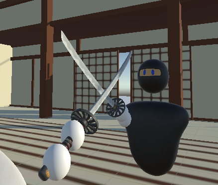
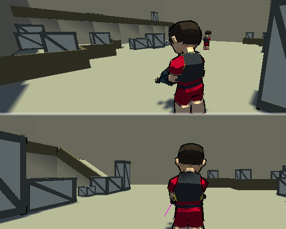

# Welcome to my Github profile!

<a align="right">I am currently a student learning about development and cybersecurity. I enjoy exploring and discovering new technologies, as well as solving complex problems.

My goal is to become an accomplished developer and cybersecurity expert. To achieve this, I'm continuously working on developing my skills and gaining experience.

On my GitHub profile, you'll find projects I've created and contributions I've made to open source projects. I'm always eager to learn and explore new opportunities.

Feel free to browse through my profile and reach out to me if you have any questions or comments about my projects. I'm open to advice and suggestions for improving my skills and projects.</a>

## Work on skills ✨
- Unity 3D 🎲
- Blender Modeling 👨‍🏭
- Computer networking 🖥️
- Video editing 📹
- 

## Web Project

## In Dev unity project 🚧
|  | **Katana Fighting** |
|----------------------------------------------------|---------------------|
| Game types: `1v1`, `katana`, `mechanical`          |                     |

|  | **Shooter Maker**   |
|----------------------------------------------------|---------------------|
| Game types: `1v1`, `craft`, `aim`                   |                     |

