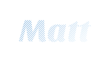

# 

<a align="left">I am currently a student learning about development and cybersecurity. I enjoy exploring and discovering new technologies, as well as solving complex problems.

My goal is to become an accomplished developer and cybersecurity expert, and to achieve this goal, I am working to develop my skills and gain experience.

On my GitHub profile, you will find projects that I have created, as well as contributions that I have made to open source projects. I am always looking for new opportunities to learn more.

Feel free to browse my profile and contact me if you have any questions or comments about my projects. I am always open to advice and suggestions for improving my skills and projects.<a/>

## Work on skills ✨
- Unity 3d 🎲
- Blender Modeling 👨‍🏭
- Computer networking 🖥️
- video editor 📹
<!--
**Mapics/Mapics** is a ✨ _special_ ✨ repository because its `README.md` (this file) appears on your GitHub profile.

Here are some ideas to get you started:

- 🔭 I’m currently working on ...
- 🌱 I’m currently learning ...
- 👯 I’m looking to collaborate on ...
- 🤔 I’m looking for help with ...
- 💬 Ask me about ...
- 📫 How to reach me: ...
- 😄 Pronouns: ...
- ⚡ Fun fact: ...
-->
